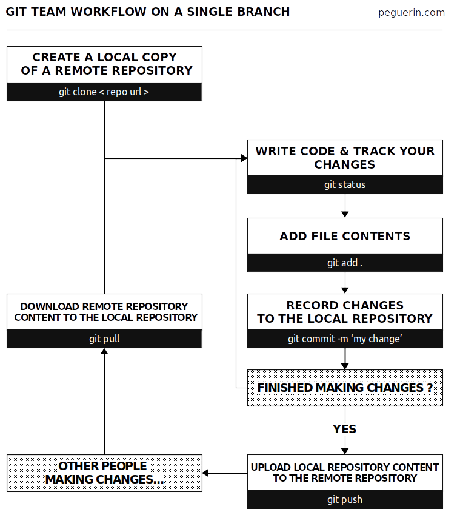
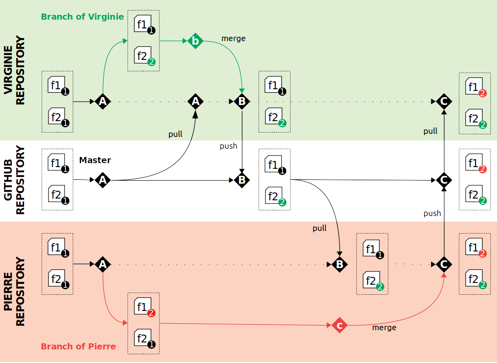
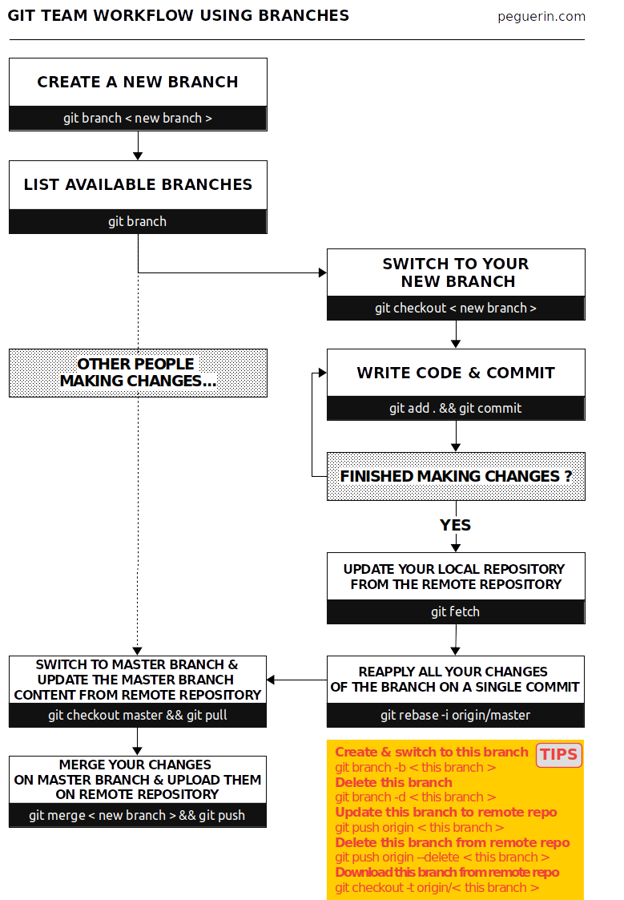

# Workshop `git`
  

Introduction à `git` et github avec pour usecase le projet du Rtidytuesday week 47.
Les scripts utilisés ont été tirés des publications libre des utilisateurs du [Rtidytuesday](https://github.com/rfordatascience/tidytuesday) sur twitter.

Pour en savoir plus sur le projet et les données, [cliquez ici](https://github.com/rfordatascience/tidytuesday/tree/master/data/2019/2019-11-19)

# Dictionnaire des données

## `nz_bird`

|variable  |class     |description |
|:---------|:---------|:-----------|
|date      | date    | Date of vote (ISO 8601) |
|hour      |double    | Hour of vote (numeric)|
|vote_rank |character | Vote rank, 1-5, where 1 is highest, and 5 is lowest |
|bird_breed |character | Bird breed |


# Phase 1 - Clonez moi

```
git clone https://github.com/ednaMontpellier/workshop_git.git
```


# Phase 2 - Un projet à tour de role





Chacun son tour, vous ajouterez une feature qui vous a été confiée parmis celles-ci:

1) Change barplot colors by the provided palette 
2) Change x axis angle
3) Add contouring in barblot
4) Rename title to be more explicit: "Best ranked bird in New Zealand"
5) Add a caption: "Data source: Rtidytuesday' 
6) Change theme to classic
7) Add the number of observations on top on each bar
8) Change the caption font to italic
9) Change the order of birds by sorted abundance in x axis
10) Change title size to 18

Les codes de base ainsi que la correction complète sont dans le dossier [copy_me](copy_me) donc vous pouvez simplement copier/coller la partie du code source de ces scripts correspondant a votre tache. Le but de ce TP est d'utiliser `git` (pas de passer trop de temps sur la programmation R donc)

## Premier tour

Chacun son tour vous utiliserez les commandes git principales. [feature 1-5]

```
git pull
git add
git commit
git push
```

Ces commandes sont à taper dans le terminal dans le répertoire du dossier git. A noter que Rstudio intègre Git et permet d'effecter ces taches de façon très simple en click-bouton. Il est toutefois important de bien comprendre les actions effectuées par chacune des étapes, qu'elles soient effectuées manuellement ou à travers Rstudio (ou Atom, autre gestionnaire de script intégrant Git)

## Deuxieme tour

On refait un tour pour vérifier que tout le monde a bien compris (en ajoutant une modification). [features 6-10]

# Phase 3 - Collaborer en travaillant en parallèle


Notion de branches. 







```
git branch
git checkout
git add
git commit
git rebase
git merge
git checkout
git pull
```

Chaque personne a une feature a programmer sur un script personnel qu'il/elle enregistre sur sa propre branche. Quand tout le monde a terminé de travailler, on merge les branches de tout le monde.

Encore une fois les solutions sont dans [copy_me](copy_me) ne perdez pas trop de temps à coder en R, le but c'est de pratiquer `git`.


|#script |feature1     |feature2 |
|:---------|:---------|:-----------|
|#2      | fix bug font    | change size caption |
|#3      | change bird text to line color    | change point shape to triangle |
|#4      | change background color to gray14    | remove background lines  |
|#5      | remove one fill parameter    |  assemble all plots in one |
|#6      | color strip text color to white    | change background to black + remove lines |


## Premier tour

Tout le monde programme la feature 1 de son script sur sa branche en même temps. On merge chaque branche une fois la modification effectuée. 

## Deuxieme tour

On recommence, cette fois ci tout le monde programme la feature 2 de son script sur sa nouvelle branche, puis on les merge toutes sur master. 

# NB

En cas de problème nécessitant l'assistance ou l'attention des autres personnes travaillant sur le projet, il est possible de remplir une `issue` dans github.   
En explicitant bien sa demande ou son bug, on peut plus facilement obtenir de l'aide ou une ressource. 

# Credits

First, to the Rtidytuesday repo:   
https://github.com/rfordatascience/tidytuesday/tree/master/data/2019/2019-11-19  

Then, to all contributors found on twitter which served as base material for this exercice:
https://github.com/gkaramanis/tidytuesday/tree/master/week-47  
https://github.com/stomperusa/TidyTuesday
https://github.com/jkaupp/tidytuesdays/tree/master/2019/week47
https://github.com/r0mymendez/R/tree/master/TidyTuesday/20191124-New%20Zealand%20Bird%20of%20the%20Year
https://github.com/jwatzek/tidytuesday

Workshop made by Virginies MARQUES & Pierre-Edouard GUERIN
